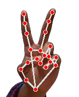
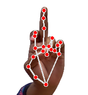
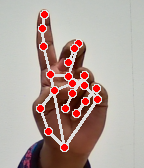
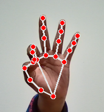
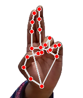

# Gesture-Based Control System

This project is a gesture-based control system that utilizes computer vision and machine learning to recognize hand gestures and translate them into corresponding actions.

## Installation

To set up and run this project, install the required dependencies:

```sh
pip install numpy opencv-python mediapipe pyautogui google.protobuf pynput comtypes
```

## Required Libraries

Ensure you have the following libraries installed:

```python
import numpy as np
import cv2
import mediapipe as mp
import pyautogui
import math
from enum import IntEnum
from ctypes import cast, POINTER
from comtypes import CLSCTX_ALL
import subprocess
from time import sleep
from google.protobuf.json_format import MessageToDict
from pynput.keyboard import Controller, Key
```

## Usage

Run the program using:

```sh
python start.py
```

### Navigating the On-Screen Controls

1. **Mouse Activate**  
   

2. **Mouse Left Click**  
   

3. **Mouser Right Click**  
   

4. **Selecting Options**  
   
   
5. **Keyboard Button Click**  
   

These images show how different hand gestures are used to interact with the system.

## Features

- Real-time gesture detection using MediaPipe
- Control computer functions using hand gestures
- Uses OpenCV for image processing

## License

This project is open-source and available for modification and distribution.

## Citation

This project is based on a published research article. If you use this work in your research, please cite it as follows:

Sadman Sakib Alif, Promise, N. A., & Aniqua Nusrat Zereen. (2024). A Two-Stage Framework for Dynamic Two-Hand On-Screen Keyboard-Mouse Interaction. 30–37. https://doi.org/10.1145/3678429.3678434

‌For the full citation details, please refer to the published article:

[Gesture-Based Control System - ACM Digital Library](https://dl.acm.org/doi/abs/10.1145/3678429.3678434)


